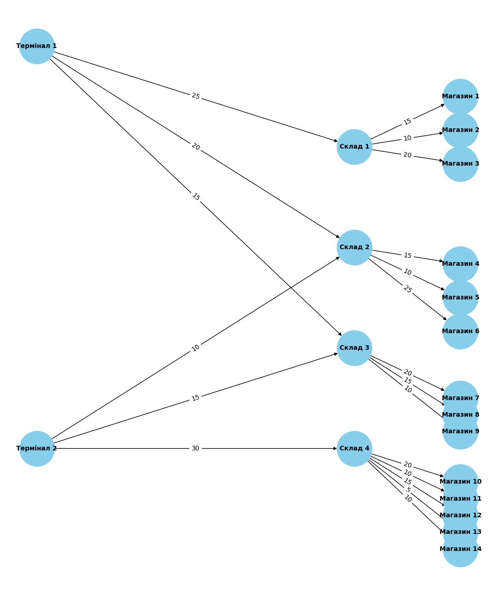

# goit-algo2-hw-03

# Першочергові налаштування
1. Сворюємо віртуальне середовище:
```
python -m venv venv
```
2. Активуємо віртуальне середовище:
```
source venv/bin/activate
```
3. Проінсталюйте залежності:
```
pip install -r requirements.txt 
```
----
# Завдання 1. Застосування алгоритму максимального потоку для логістики товарів

#### Приклад використання
```
python task1.py
```
#### Виведе:


### Таблиця потоку між терміналами та магазинами:

| Термінал   | Магазин   | Фактичний потік (одиниць) |
|------------|-----------|---------------------------|
| Термінал 1 | Магазин 1 | 15                        |
| Термінал 1 | Магазин 2 | 10                        |
| Термінал 1 | Магазин 3 | 20                        |
| Термінал 1 | Магазин 4 | 15                        |
| Термінал 1 | Магазин 5 | 10                        |
| Термінал 1 | Магазин 6 | 20                        |
| Термінал 1 | Магазин 7 | 15                        |
| Термінал 1 | Магазин 8 | 15                        |
| Термінал 1 | Магазин 9 | 10                        |
| Термінал 1 | Магазин 10| 0                         |
| Термінал 1 | Магазин 11| 0                         |
| Термінал 1 | Магазин 12| 0                         |
| Термінал 1 | Магазин 13| 0                         |
| Термінал 1 | Магазин 14| 0                         |
| Термінал 2 | Магазин 1 | 0                         |
| Термінал 2 | Магазин 2 | 0                         |
| Термінал 2 | Магазин 3 | 0                         |
| Термінал 2 | Магазин 4 | 10                        |
| Термінал 2 | Магазин 5 | 10                        |
| Термінал 2 | Магазин 6 | 10                        |
| Термінал 2 | Магазин 7 | 15                        |
| Термінал 2 | Магазин 8 | 15                        |
| Термінал 2 | Магазин 9 | 10                        |
| Термінал 2 | Магазин 10| 20                        |
| Термінал 2 | Магазин 11| 10                        |
| Термінал 2 | Магазин 12| 15                        |
| Термінал 2 | Магазин 13| 5                         |
| Термінал 2 | Магазин 14| 10                        |


### Відповіді на запитання:
1. Які термінали забезпечують найбільший потік товарів до магазинів?
- Термінал 1 забезпечує найбільший потік товарів. Він поставляє товар до 9 магазинів, і максимальний потік товарів до магазинів (особливо Магазин 3 і Магазин 6) становить 20 одиниць.
- Термінал 2 також активно постачає товари, але загальний потік менший, із максимальним потоком до Магазину 10 (20 одиниць) і деякими магазинами, де потік менший, ніж у Термінала 1.

2. Які маршрути мають найменшу пропускну здатність і як це впливає на загальний потік?
- Магазин 10 отримує найвищий потік від Термінала 2 (20 одиниць), а інші магазини (Магазини 1, 2, 3, 4) отримують набагато менше, що свідчить про вузькі місця в маршрутах між терміналами та складами.
- Наприклад, маршрути від Складів до Магазинів 13 та 14 мають низьку пропускну здатність (5 і 10 одиниць відповідно), що обмежує потік товарів до цих магазинів.
- Маршрути від Термінала 1 до Магазинів 10-14 також мають нульовий потік, що свідчить про відсутність можливості доставки товарів на ці маршрути.

3. Які магазини отримали найменше товарів і чи можна збільшити їх постачання, збільшивши пропускну здатність певних маршрутів?
- Магазини 10, 11, 12, 13 і 14 отримують найменше товарів, особливо Магазини 10-14 від Термінала 1, де потік дорівнює нулю.
- Для збільшення постачання до цих магазинів можна було б збільшити пропускну здатність маршрутів від терміналів до складів (наприклад, від Термінала 1 до Складу 4, який має обмеження на потік), або вдосконалити маршрути від Складу 4 до Магазинів 10-14.

4. Чи є вузькі місця, які можна усунути для покращення ефективності логістичної мережі?
- Вузькі місця: це обмеження пропускної здатності на маршрутах між терміналами і складами, а також між складами та магазинами. В основному це стосується:
    - Маршрутів між Терміналом 1 і Магазинами 10-14 (все з нульовим потоком).
    - Вузькі місця між складами та магазинами, де пропускна здатність обмежує потік (наприклад, маршрути до Магазину 13).
- Для покращення ефективності можна оптимізувати маршрути, збільшити пропускну здатність найбільш обмежених маршрутів (наприклад, через зміни в інфраструктурі або перепланування), а також зменшити кількість непродуктивних маршрутів, які не несуть потік.

----

### Підсумок:
    Програма коректно обчислює максимальний потік і генерує точні результати для кожного маршруту. Звіт включає необхідні відповіді, які дозволяють провести аналіз ефективності логістичної мережі та визначити можливості для її вдосконалення.

----

# Завдання 2. Порівняння ефективності OOBTree і словника для діапазонних запитів

#### Приклад використання
```
python task2.py
```
#### Виведе:
````
Загальний час виконання діапазонного запиту для 0.001115 секунд
Загальний час виконання діапазонного запиту для 0.643016 секунд
````

### Підсумок:
    Оскільки OOBTree використовує відсортовану структуру даних, вона демонструє набагато кращу ефективність при виконанні діапазонних запитів порівняно зі стандартним словником dict, де запит виконується лінійно по всіх елементах.
    Час виконання запитів для OOBTree значно менший (0.001086 секунди), тоді як для dict — набагато більший (0.646696 секунди).
    Таким чином, структура OOBTree є більш ефективною для діапазонних запитів, що підтверджує правильність вибору цієї структури для таких завдань.